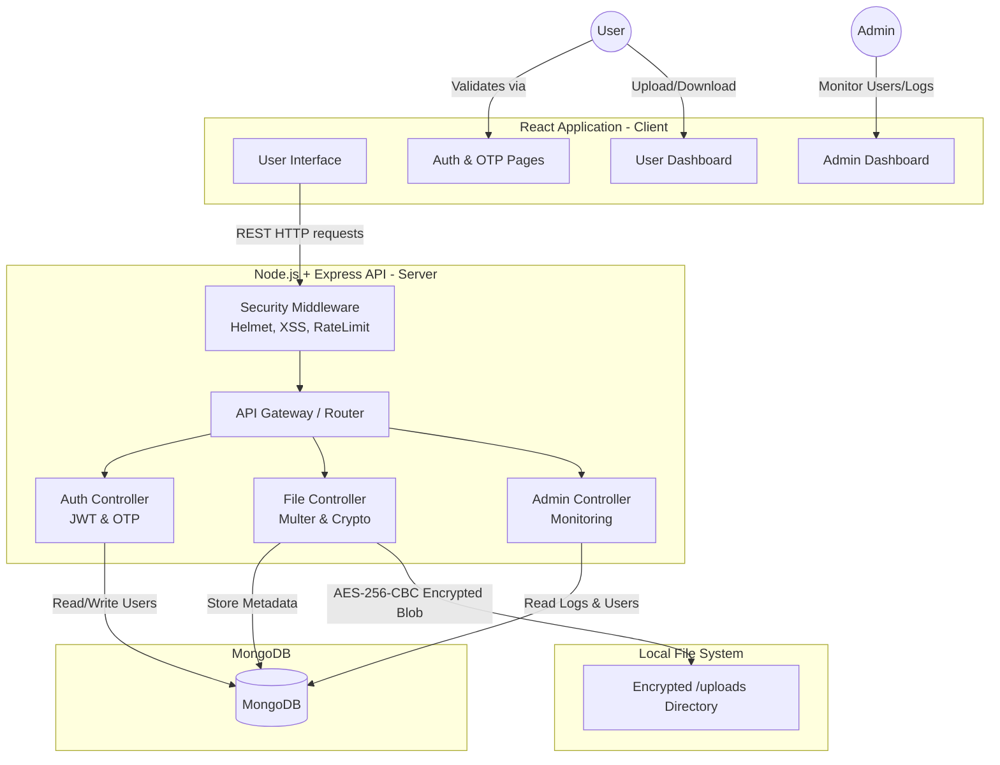
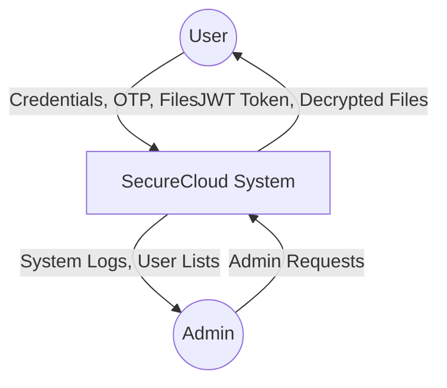
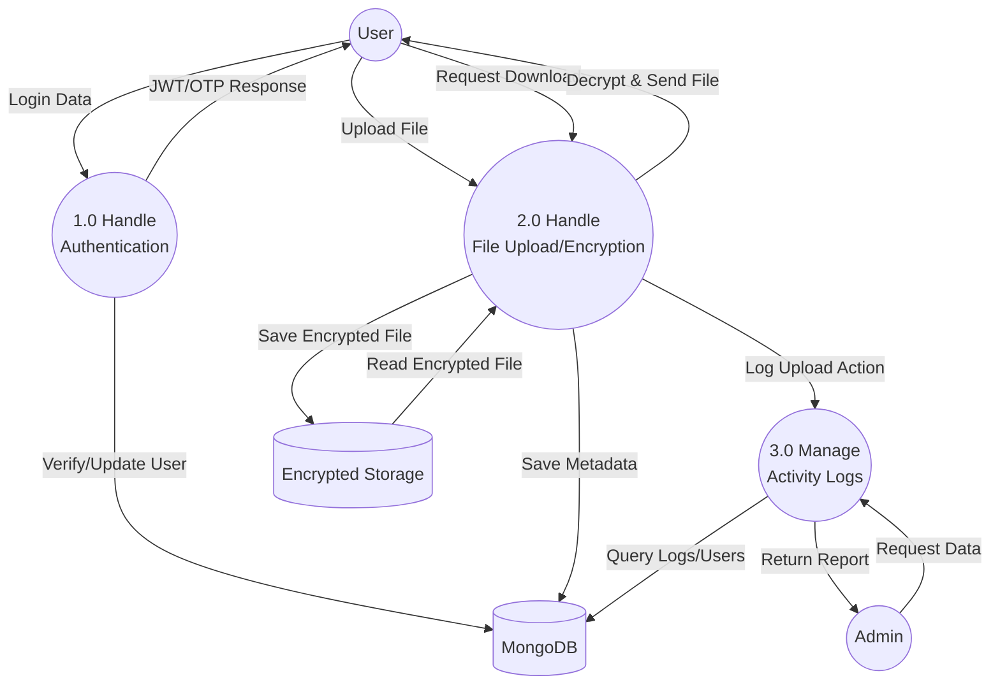
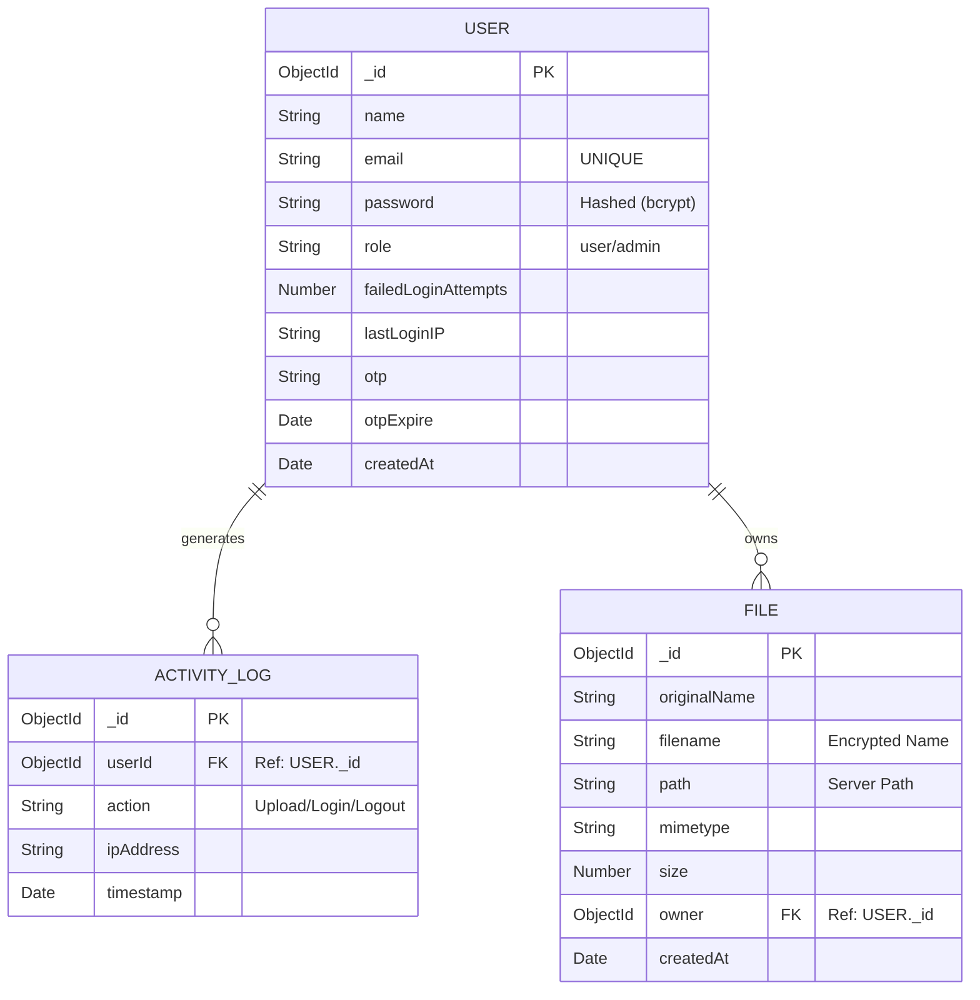
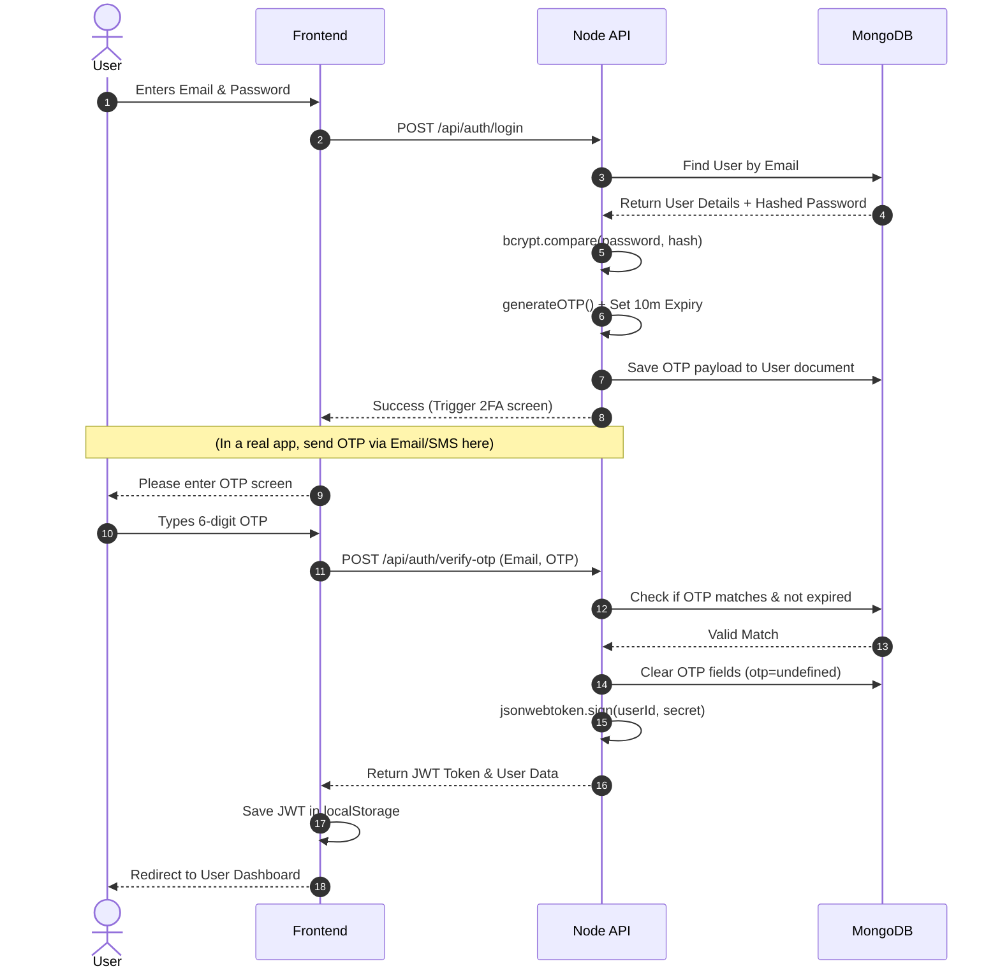

# 🔐 SecureCloud - Project Report Documentation

This document contains all the major system diagrams and flow explanations required for the SecureCloud project report. You can use tools like Mermaid Live Editor (https://mermaid.live/) or modern Markdown viewers that support MermaidJS to render and export these diagrams as images for your report.

---

## 🏗️ 1. System Architecture Diagram

The SecureCloud architecture follows a typical MERN stack with specialized services for authentication, AES file encryption, and admin monitoring.

---

## 🌊 2. Data Flow Diagram (DFD)

### Level 0 DFD (Context Diagram)
This diagram shows the high-level interactions between external entities (User/Admin) and the entire SecureCloud System.

### Level 1 DFD (Process Level)
This breaks down the System into its core sub-processes.

---

## 🗄️ 3. Entity-Relationship (ER) Diagram

This diagram maps out our MongoDB Models: `User`, `File`, and `ActivityLog`.

---

## 🛡️ 4. Security Flow (Authentication & 2FA Sequence)

This sequence diagram explains the exact chronological steps of your backend security highlights (bcrypt password comparison, OTP delivery, and JWT verification).

